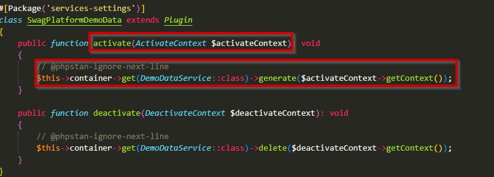
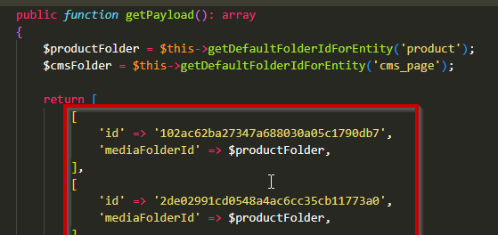
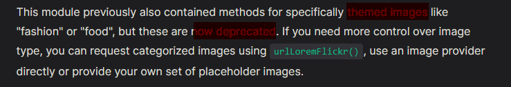
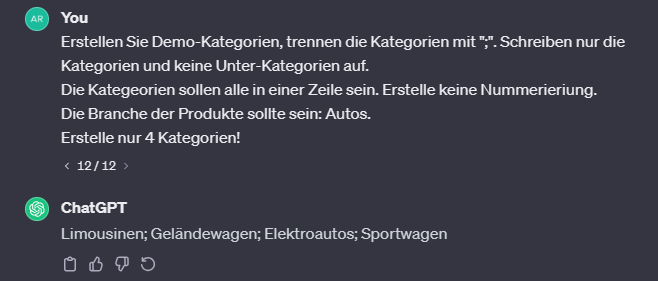
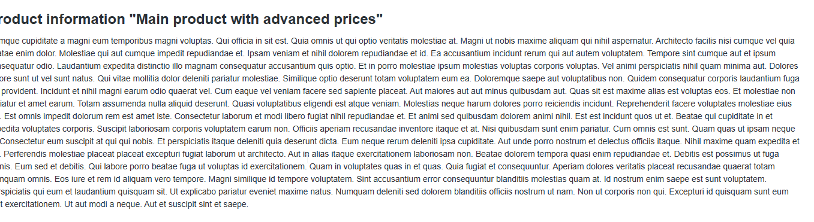

# Idea

We want to extend the **SwagPlatformDemoData** and add IA Generation for every aspect of this Plugin. 
<strike>I think the best way is to add the AI parts into the Provider classes. Testing out if the API with faker works correctly.
Faker is a JS based and runs on the browser or node. Therefor I have to add JS code.</strike>
Using OpenAI API we will fetch Data stepp by stepp. <strike>When this test works,</strike> we can create a [selectable list or CLI command] on What the Shop is trying to sell (Bikes, Cars, etc). Wiht that that the API will create stepp by stepp the neccesery context data like Images, Categorys, and Headlins for Products. We will fill out large String sets for Description with Faker

> Future plans can be: Adding how many products should be generated.

## SwagPlatformDemoData

### How this Plugin generates Data

The plugin starts creating the Demo Data on Activation. It will also remove created Data from the Shop when the plugin is deactivated.

 

it simply calls the sync API to store Data end remove Data. All the Data for Product, Media etc. is handled in the corresponding child classes. The Payload is structured in a way that the Sync API just uses the payload. DemoDataProvider is an abstract class for reusing the three functions for creating Data.




## Alteration to add `FakerJS` or Fake Data

We need to remove the data creation on Activation and replace it with an CLI command. For the start the CLI command should only create a fixed amount of data for a selected shop category. Later we can plan on defining how many Data eg. (Category, Products etc.) the DemoData should create.

The Data Provider child classes can be reuse to insert the created Data from `FakerJS` instant of just using what's written.


<strike>

## Addition JavaScript `FakerJS` 

`FakerJS` is a JavaScript API to generate fake data. To use the FakerJS data generation, we have to create a function for creating Data to how we need it. Faker will generate Random Data! And only Random Data. There is a limited control on what is generated, but this needs investigation and testing [Faker Test](https://runkit.com/haylan/65702eab4c1a5f0008ab4eaf). A solution would be to generate a List of Fake Products, order them by category and ony use Products which are needed for the store.

## Big Problem

Images is a big problem for the Shop. We need to find an free to use Image generation or Database system where we can grab images for testing or showcase purpose. A really annoying feature removal from Faker is that we cannot generate themed fake images. 



The Themed images needs to be generated by flicker like that 
```typescript 
faker.image.urlLoremFlickr({category: 'THEME like COMPUTER',})
```

</strike>

## ChatGPT creating data step by step

### Categories
```
Erstelle Demo-Kategorien, trennen die Kategorien mit ";". Schreiben nur die Kategorien und keine Unter-Kategorien auf.
Die Kategorien sollen alle in einer Zeile sein. Erstelle keine Nummerierung.
Die Branche der Produkte sollte sein: [SHOPSELLINGTHEME].
Erstelle nur [NUMBER] Kategorien!
```
### ChatGPT
```
Softdrinks; Fruchtsäfte; Mineralwasser; Energydrinks; Kaffeegetränke; Teegetränke; Sportgetränke; Limonaden; Eistee; Milchshakes

```
---

### Under Categories
```
Nenne für [KATEGORY] Unterkategorien, trennen die Kategorien mit ";". Schreibe nur die Unterkategorien auf.
Die Unterkategorien sollen alle in einer Zeile sein. Erstelle keine Nummerierung.
Erstelle nur [NUMBER] Kategorien!
```
### ChatGPT
```
Sedan; Coupé; Cabriolet; Kombi; Luxuslimousine; Sportlimousine; Elektrolimousine; Hybridlimousine; Kompaktlimousine; Oberklasse-Limousine
```

---

### Brands
```
Nenne für [KATEGORY] Markennamen, trennen die Kategorien mit ";". Schreibe nur die Markennamen auf.
Die Markennamen sollen alle in einer Zeile sein. Erstelle keine Nummerierung.
Erstelle nur [NUMBER] Kategorien!
```
### ChatGPT
```
Coca-Cola; Pepsi; Sprite; Fanta; Dr Pepper; Mountain Dew; 7UP; Red Bull; Schweppes; Mirinda
```

---

### Names
```
Nenne für [UNDERKATEGORY] Produktnamen, trennen die Kategorien mit ";". Schreibe nur die Produktnamen auf.
Die Produktnamen sollen alle in einer Zeile sein. Erstelle keine Nummerierung.
Erstelle nur [NUMBER] Kategorien!
```

### ChatGPT
```
Coca-Cola Original; Coca-Cola Zero Sugar; Coca-Cola Light; Coca-Cola Life; Coca-Cola Vanilla; Coca-Cola Cherry; Coca-Cola Orange; Coca-Cola Lemon; Coca-Cola Lime; Coca-Cola Raspberry; Coca-Cola Ginger; Coca-Cola Cinnamon; Coca-Cola Coffee; Coca-Cola Energy; Coca-Cola Signature Mixers; Coca-Cola Clear; Coca-Cola Plus Coffee; Coca-Cola No Sugar; Coca-Cola Life Exotic Mango; Coca-Cola Life Spicy Cherry; Coca-Cola Life Apple; Coca-Cola Life Peach; Coca-Cola Life Summer; Coca-Cola Life Winter; Coca-Cola Life Spring; Coca-Cola Life Autumn; Coca-Cola Life Tropical; Coca-Cola Life Forest Fruits; Coca-Cola Life Ocean Breeze; Coca-Cola Life Mountain Mist; Coca-Cola Life Desert Oasis; Coca-Cola Life Arctic Frost; Coca-Cola Life Polar Punch; Coca-Cola Life Savanna Sunset; Coca-Cola Life Jungle Juice; Coca-Cola Life Prairie Punch; Coca-Cola Life Urban Utopia; Coca-Cola Life Suburban Serenity; Coca-Cola Life Coastal Calm; Coca-Cola Life Country Charm; Coca-Cola Life Vintage Velvet; Coca-Cola Life Modern Marble; Coca-Cola Life Classic Concrete; Coca-Cola Life Rustic Rock; Coca-Cola Life Artisanal Amber; Coca-Cola Life Galactic Gold; Coca-Cola Life Futuristic Platinum; Coca-Cola Life Ethereal Emerald; Coca-Cola Life Mystical Sapphire; Coca-Cola Life Celestial Copper.
```

#### Testing images
 


## faker-provider-collection

### creating Fake data Description 

```PHP
'description' => $this->translationHelper->adjustTranslations([
                    'de-DE' => $faker->text(3000),
                    'en-GB' => $faker->text(3000),
                    'pl-PL' => $faker->text(3000),
                ]),
                'manufacturer' => [
                    'id' => 'cc1c20c365d34cfb88bfab3c3e81d350',
                    'name' => $this->translationHelper->adjustTranslations([
                        'de-DE' => $faker->text(255),
                        'en-GB' => $faker->text(255),
                        'pl-PL' => $faker->text(255),
                    ]),
....
....
...
..
.
```



<br><br><br>

---
---

> **Important commands for testing**
>
>bin/console plugin:deactivate SwagPlatformDemoData <br>
>bin/console plugin:activate SwagPlatformDemoData

> **Important links**
>
>https://fakerjs.dev/guide/<br>
>https://developer.shopware.com/docs/guides/plugins/plugins/storefront/add-custom-javascript.html<br>
>https://github.com/shopware/shopware/blob/161533ad8413fcb26a7fdb6237e78abc564e6b21/src/Storefront/Resources/app/storefront/src/plugin-system/plugin.class.js#L10<br>

> **Usefull information**<br>
>
> custom JavaScript for the Admin page in Shopware<br>
>`<plugin root>/src/Resources/app/administration/src directory.`<br>
> BottleJS (Service) to user JS in PHP<br>
> JS in the Storefront uses DOM<br>

> **Other Faker Tools**
>
> [AI Placeholder](https://github.com/terryds/ai-placeholder)<br>
> [Falso](https://ngneat.github.io/falso/)<br>
> [mocker-data-generator](https://github.com/danibram/mocker-data-generator) Uses `FakerJS` but is controllable<br>
> [Freepik](https://www.freepik.com/api)<br>
> [Deepai](https://deepai.org/machine-learning-model/text2img)<br>
> **[Faker Provider Collection](https://github.com/mbezhanov/faker-provider-collection)**<br>
> **[Faker](https://github.com/fakerphp/faker)**<br>
> **[PHP OpenAI API](https://github.com/openai-php/client)**<br>
