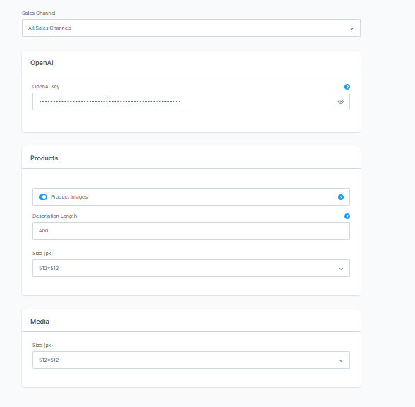

# AI Demo Data

AI demo data is generated via th CLI:

```ruby
php bin/console ai-demodata:generate:products --keywords=''
```
there also some settings you can do at the Admin Page


Chat GPT gets that string:
```php
        $prompt = 'Create a list of demo products with these properties, separated values with ";". Only write down values and no property names ' . PHP_EOL;
        $prompt .= PHP_EOL;
        $prompt .= 'the following properties should be generated.' . PHP_EOL;
        $prompt .= 'Every resulting line should be in the order and sort provided below:' . PHP_EOL;
        $prompt .= PHP_EOL;
        $prompt .= 'product count.' . PHP_EOL;
        $prompt .= 'product number code. should be 16 unique random alphanumeric.' . PHP_EOL;
        $prompt .= 'name of the product.' . PHP_EOL;
        $prompt .= 'description (about ' . $descriptionLength . ' characters).' . PHP_EOL;
        $prompt .= 'price value (no currency just number).' . PHP_EOL;
        $prompt .= 'EAN code.' . PHP_EOL;
        $prompt .= 'SEO description (max 100 characters).' . PHP_EOL;
        $prompt .= PHP_EOL;
        $prompt .= 'Please only create this number of products: ' . $maxCount . PHP_EOL;
        $prompt .= PHP_EOL;
        $prompt .= 'The industry of the products should be: ' . $keywords;

```

The AI generated Tex is cut  on every line. 