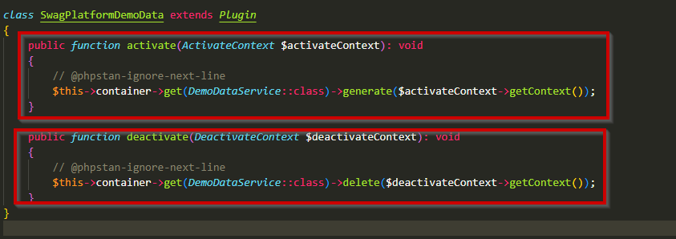
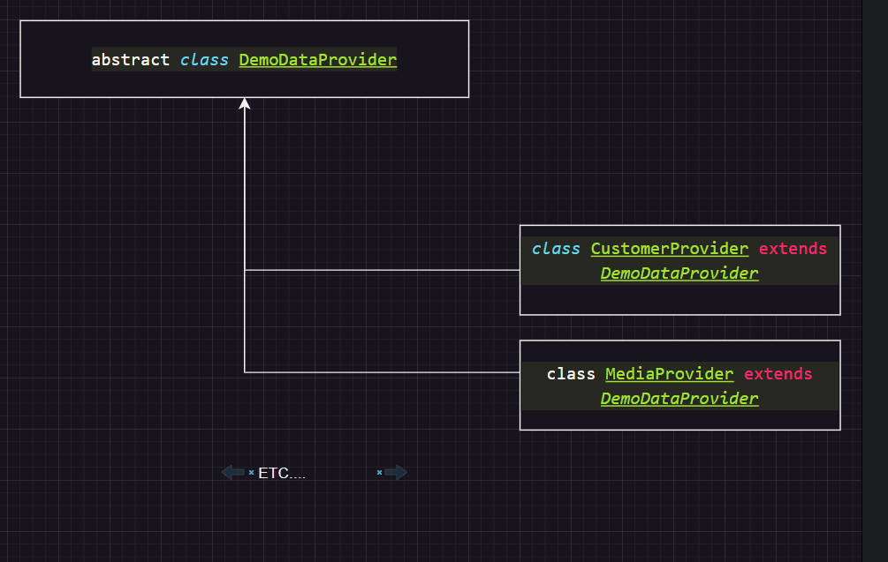

# Inner workings of the SwagPlatformDemoData



```PHP

public function activate(ActivateContext $activateContext): void
{
    // @phpstan-ignore-next-line
    $this->container->get(DemoDataService::class)->generate($activateContext->getContext());
}

public function deactivate(DeactivateContext $deactivateContext): void
{
    // @phpstan-ignore-next-line
    $this->container->get(DemoDataService::class)->delete($deactivateContext->getContext());
}

```

When the Plugin is activatet, starts the `generate` function. It grabs the Data from the *provider.php Classes. There it is written in JSON.



Example:

```php
public function getPayload(): array
{
    $cmsPageId = $this->getDefaultCmsListingPageId();

    return [
        [
            'id' => $this->getRootCategoryId(),
            'cmsPageId' => '695477e02ef643e5a016b83ed4cdf63a',
            'active' => true,
            'displayNestedProducts' => true,
            'visible' => true,
            'type' => 'page',
            'name' => $this->translationHelper->adjustTranslations([
                'de-DE' => 'Katalog #1',
                'en-GB' => 'Catalogue #1',
            ]),
            'children' => [
                [
                    'id' => '77b959cf66de4c1590c7f9b7da3982f3',
                    'cmsPageId' => $cmsPageId,
                    'active' => false,
                    'displayNestedProducts' => true,
                    'visible' => true,
                    'type' => 'page',
                    'name' => $this->translationHelper->adjustTranslations([
                        'de-DE' => 'Lebensmittel',
                        'en-GB' => 'Food',
                    ]),
                .
                .
                .
```